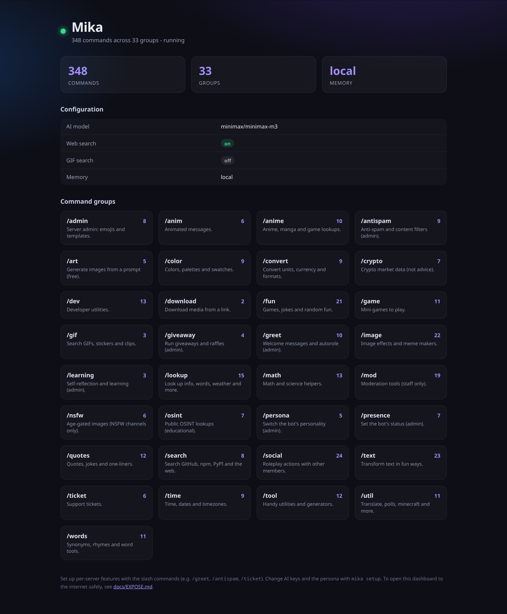

# Mika

A self-hostable, multi-purpose Discord bot: an LLM chat companion **and** a full
bot framework — slash commands, tickets, moderation, fun/utility, and server
quality-of-life — with a one-command installer, an interactive setup wizard, and a
localhost web page for settings and overviews.

Built in Python, designed to run on a Linux VPS under systemd.

> **License:** proprietary, source-available on purchase — see [`LICENSE`](LICENSE).



*The localhost dashboard (`mika web`): 340+ commands across 33 groups, at a glance.*

---

## Quickstart

```bash
./install.sh        # one command: installs uv, syncs deps, wires git hooks, runs the wizard
```

Then:

```bash
make run            # start the bot
make web            # open the localhost settings & overview page
```

No `./install.sh`? The equivalent manual path:

```bash
make install        # uv sync + pre-commit install
make setup          # interactive setup wizard (tokens, models, features)
make run
```

## Documentation

| Guide | What it covers |
|---|---|
| [docs/GETTING-STARTED.md](docs/GETTING-STARTED.md) | Beginner walkthrough — zip to running bot in ~10 min |
| [docs/DISCORD-SETUP.md](docs/DISCORD-SETUP.md) | Creating the bot, token, intents, invite, server/channel IDs |
| [docs/COSTS.md](docs/COSTS.md) | What the AI costs and how to keep it cheap |
| [docs/DEPLOY.md](docs/DEPLOY.md) | Run 24/7 — on the host or in Docker |
| [docs/EXPOSE.md](docs/EXPOSE.md) | Open the dashboard to the internet safely (Tailscale/Cloudflare) |
| [docs/HONCHO-MEMORY.md](docs/HONCHO-MEMORY.md) | Optional long-term semantic memory |

## What goes where

The repository is strictly layered — each directory has a single purpose and its
own `README.md`. The authoritative map is [`ARCHITECTURE.md`](ARCHITECTURE.md);
the contributor rules are [`AGENTS.md`](AGENTS.md).

| Path | Purpose |
|---|---|
| `src/mika/core/` | Foundations: config, logging, errors, paths |
| `src/mika/persistence/` | Storage: db engine, models, repositories |
| `src/mika/ai/llm/` | **AI domain** — inference: providers, chat, memory, tools (no Discord) |
| `src/mika/ai/learning/` | **AI domain** — optional self-learning (Hermes reviewer, feedback, reflection) |
| `src/mika/bot/` | **Server domain** — bot account: commands, events, components, features |
| `src/mika/userbot/` | **User domain** — personal selfbot QoL (ToS-grey, not shipped, separate env) |
| `src/mika/web/` | Webserver backend: settings + overview API |
| `src/mika/cli/` | CLI + setup wizard (entrypoint: `mika`) |
| `src/mika/system/` | systemd / process control |
| `frontend/` | The localhost UI (separate from backend) |
| `deploy/` | systemd units, docker, reverse-proxy config |
| `tools/` | Dev-only: custom git hooks, scripts |
| `tests/` | Mirrors `src/mika/` |
| `docs/` | Documentation |
| `mikabot(JS)/` | **Gitignored** — old JS bot + reference repos (study only) |

## Development

```bash
make check          # ruff + mypy + pytest — run before every commit
```

Toolchain: [uv](https://docs.astral.sh/uv/) · [ruff](https://docs.astral.sh/ruff/)
· [mypy](https://mypy.readthedocs.io/) · [pytest](https://docs.pytest.org/) ·
[pre-commit](https://pre-commit.com/). All rules in [`AGENTS.md`](AGENTS.md) are
enforced by git hooks.
